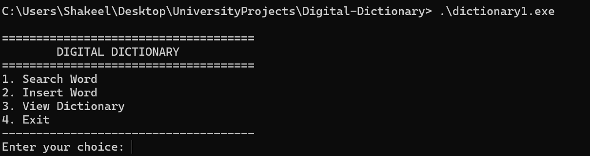
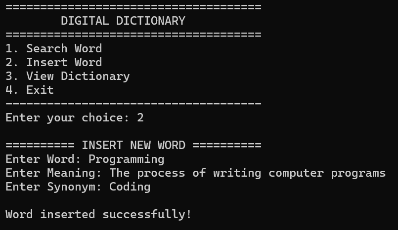
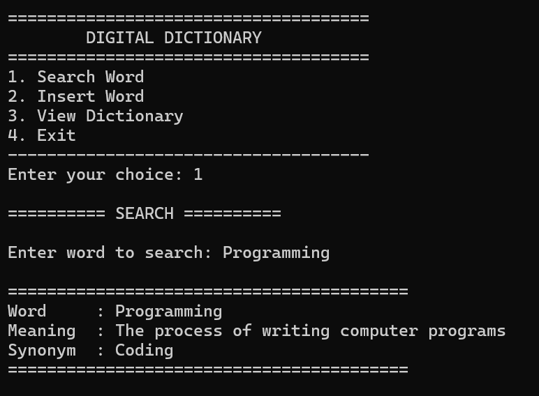
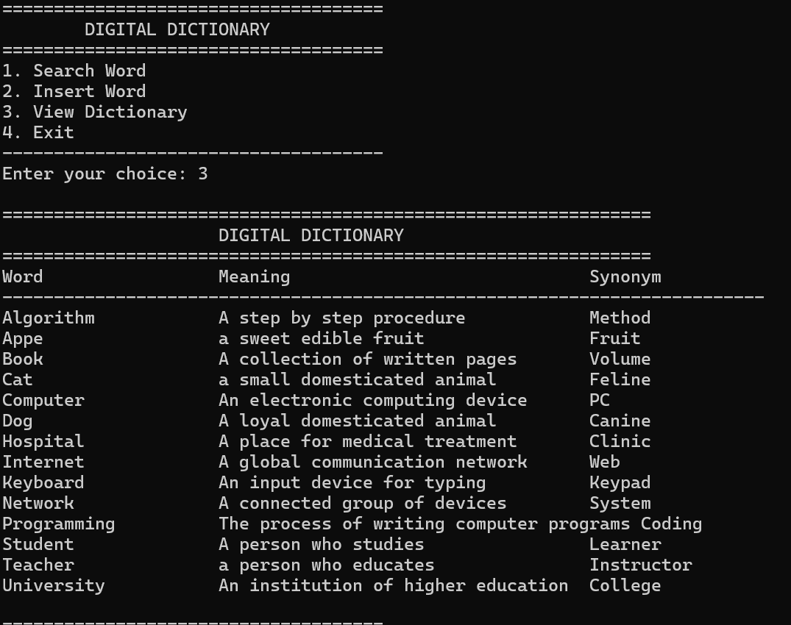
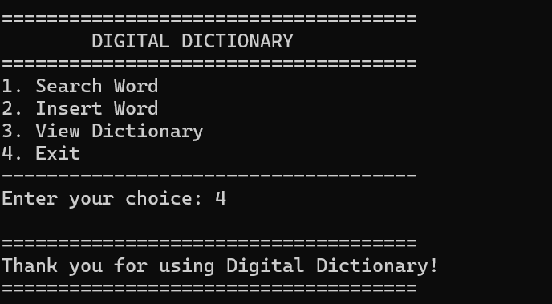

# 📖 Digital Dictionary (C)


A console-based **Digital Dictionary** developed during my **first semester of Bachelor's studies** while learning the fundamentals of C programming. The application allows users to insert, search, and view dictionary entries consisting of words, meanings, and synonyms using a Binary Search Tree (BST) data structure.

This repository has been preserved as part of my programming journey and serves as a record of my early software development experience.

---

## 📚 University Archive

**Course:** Programming Fundamentals  
**Language:** C  
**Semester:** 1st Semester (Bachelor's)  
**Project Type:** Console Application

> This project is part of my University Archive Series, where I preserve significant academic projects from throughout my bachelor's degree. The original implementation has been retained as closely as possible in main1.c file, with only minor modifications for compatibility and project organization.

---

## ✨ Features

- Add new words to the dictionary
- Search for existing words
- Store meanings and synonyms
- View all dictionary entries
- Menu-driven console interface
- Binary Search Tree (BST) implementation for organizing words
- Basic file handling support

---

## 🛠 Technologies Used

- C Programming
- Structures
- Dynamic Memory Allocation
- Binary Search Tree (BST)
- Functions
- File Handling
- Console-Based User Interface

---

## 📂 Project Structure

```
digital-dictionary-c/
│
├── src/
│   └── main.c
│
├── assets/
│   └── screenshots/
│
├── README.md
├── LICENSE
└── .gitignore
```

---

## 🚀 Getting Started

### Clone the repository

```bash
git clone https://github.com/Adventurw/digital-dictionary-c.git
```

### Compile

Using GCC:

```bash
gcc src/main.c -o dictionary
```

### Run

```bash
./dictionary
```

---

## 📸 Screenshots

### Home Menu


---

### Insert New Word



---

### Search Word



---

### View Dictionary



---

### Smooth Exit



---

## 📖 Learning Outcomes

This project helped me understand and practice:

- User-defined structures
- Binary Search Trees
- Dynamic memory allocation
- Function decomposition
- String handling
- Console application development
- Basic file operations

---

## 💡 Reflection

This was one of the first substantial programming projects I developed during my bachelor's degree. Looking back, there are many areas where the implementation could be improved, including modularization, input validation, and memory management.

Rather than completely rewriting the project, I have intentionally preserved its original design to document my growth as a software developer over the years. It represents an important milestone in my learning journey and serves as a reminder of where I started.

---

## 🔮 Possible Future Improvements

- Improve input validation
- Support multi-word meanings and synonyms
- Modularize the code into multiple source files
- Add delete and update operations
- Improve search functionality
- Enhance file persistence
- Create a graphical user interface (GUI)

---

## 📄 License

This project is shared for educational and portfolio purposes.

---

## 👤 Author

**Aymen Shakil**

Computer Science Graduate | AI • Cybersecurity • QA Engineering

GitHub: https://github.com/Adventurw

LinkedIn: https://linkedin.com/in/aymenshakil
